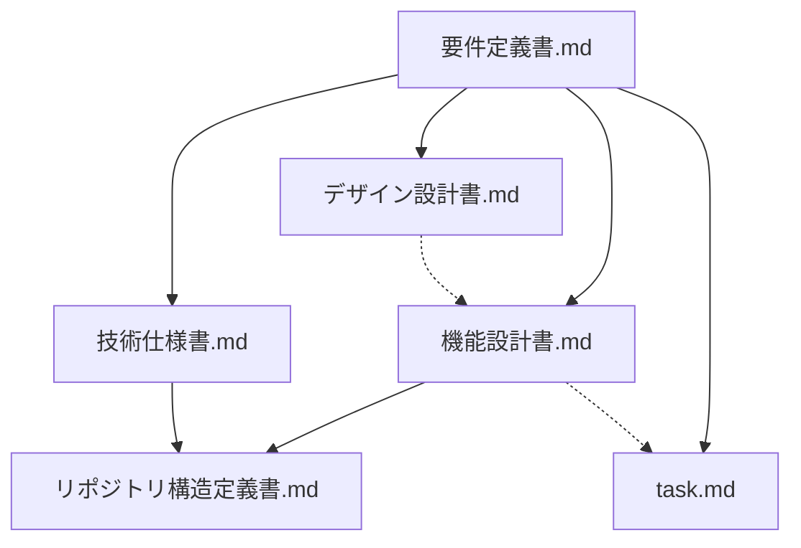

# スペック駆動開発向け 永続ドキュメント整備計画

| 項目 | 内容 |
|------|------|
| 文書名 | スペック駆動開発向け 永続ドキュメント整備計画 |
| 版数 | **1.5** |
| 作成日 | 2025-03-21 |
| 根拠 | `doc/要件定義書.md` |
| 目的 | 要件を実装・レビュー・CI に落とし込むための下位ドキュメントを `doc/` に揃え、**仕様の単一の流れ**（要件 → 設計 → 実装 → テスト）を保つ。 |

---

## 1. 計画の位置づけ

### 1.1 スペック駆動で「永続」とするもの

- **要件**は既に `要件定義書.md` に集約されている（**何を・なぜ**）。
- 本計画で追加する4種は、主に**どう見せるか・どう動かすか・何で動かすか・どこに置くか**（**どう作るか**）を固定し、実装や PR の**参照先**として残す。
- 実装中にブレた場合は**まずドキュメントを更新**し、その後コードを合わせる（仕様が先）。

### 1.2 文書間の関係（読み取りの順）

- **機能設計書**：画面・API・データ・状態遷移・例外（在庫不足など）の**振る舞い**を要件とトレース可能にする。
- **デザイン設計書**：UI の**見た目・コンポーネント階層・アクセシビリティ**を固定する（機能設計の「画面一覧」と対応付ける）。
- **技術仕様書**（※ユーザー表記「技術使用書」に相当）：採用ライブラリ・環境変数・Supabase／Vercel／CI の**使い方と制約**を固定する。
- **リポジトリ構造定義書**：ディレクトリ責務・命名・配置ルールを固定し、機能設計・技術仕様の「どこに実装するか」を一意にする。
- **`task.md`**：実装フェーズ・チェックリスト・参照ドキュメント。実装作業の入口（`要件定義書` §1・付録 B からもリンク）。

> **表記について**：本計画では第3章の正式ファイル名を **`技術仕様書.md`** とする（「使用」と「仕様」の誤記・揺れを避け、業務上の「技術仕様」に寄せる）。README や目次では「技術仕様書（技術使用・スタック）」と併記してよい。

---

## 2. 作成するファイルと役割

| ファイル名（予定） | 役割 | 主な読者 |
|--------------------|------|----------|
| `doc/デザイン設計書.md` | デザインシステム、画面レイアウト方針、主要画面のワイヤー／コンポーネント対応 | フロント実装・レビュー |
| `doc/機能設計書.md` | 画面一覧、遷移、ユースケース、API／DB 論理仕様、エラー処理、E2E シナリオとの対応 | 全開発者・テスト |
| `doc/技術仕様書.md` | スタック固定版、ローカル／Docker／Supabase／Vercel、Secrets、PWA・Sentry・Analytics、CI/CD パイプライン | インフラ・実装 |
| `doc/リポジトリ構造定義書.md` | ルート構成、Next.js の配置、`app` vs `src`、テスト・シード・ドキュメントの置き場 | 全開発者 |
| `doc/task.md` | 実装フェーズ・チェックリスト・参照ドキュメント（実装作業の入口） | 全開発者・エージェント |

---

## 3. 各ドキュメントの章立て（叩き台）

以下は**初版に含める見出しの叩き台**。実際の執筆時に `要件定義書.md` の節番号へトレース（例：`REQ-6.3.5`）を付ける。

### 3.1 デザイン設計書.md

| 章（案） | 内容 |
|----------|------|
| 1. 目的・対象外 | アクセシビリティ方針、ブランドは架空である旨 |
| 2. デザイン原則 | 情報密度、在庫／注文の誤操作防止（確定ボタン、在庫不足表示） |
| 3. デザイントークン | 色・タイポ・間隔・角丸（Tailwind／shadcn との対応方針） |
| 4. コンポーネント方針 | shadcn の採用範囲、独自ラッパの有無、フォーム・テーブル・ダイアログ |
| 5. レスポンシブ | ブレークポイント、モバイルでのスキャン UI |
| 6. 画面別 UI 仕様 | ダッシュボード、在庫（入れ子）、注文作成、レポート、設定、管理 |
| 7. PWA | インストール促進、オフライン時のシェル表示文言 |
| 8. 要件トレース | `要件定義書` 6.x・7.x との対応表 |

**入力**：要件定義書 §6・§7、`plan.txt` の UI 期待。  
**依存**：機能設計書の「画面一覧」と ID を揃えると保守しやすい（**先に機能設計で画面 ID を振ることを推奨**）。

---

### 3.2 機能設計書.md

| 章（案） | 内容 |
|----------|------|
| 1. 目的・用語 | 要件書との差分（本書は振る舞いまで定義） |
| 2. コンテキスト図 | 利用者・外部サービス（Supabase、Vercel、Sentry） |
| 3. 画面一覧 | 画面 ID、URL 方針、認証要否、主要コンポーネント参照 |
| 4. ユースケース | ログイン、CSV 更新、入庫スキャン、注文確定（在庫不足時）、エクスポート |
| 5. 画面遷移 | 遷移図（Mermaid） |
| 6. データ設計（論理） | テーブル一覧、主キー・自然キー、注文確定トランザクション、履歴の理由区分 |
| 7. API／サーバー処理 | Route Handlers / Server Actions の有無方針、認可チェックの置き場 |
| 8. バリデーション・エラー | 在庫不足、CSV 形式エラー、認証切れ |
| 9. 帳票・エクスポート | PDF／Excel の対象範囲とパラメータ（期間など） |
| 10. シード | 開発のみ、append、冪等キー（要件 8.4 の具体化） |
| 11. テスト観点 | E2E シナリオと画面 ID の対応、CI で必須のパス |
| 12. 要件トレース表 | 要件定義書 節 ↔ 本章 |

**入力**：要件定義書 全文、特に §6・§8・§9。  
**依存**：なし（**最初に着手しやすい下位仕様**）。

---

### 3.3 技術仕様書.md（技術使用書に相当）

| 章（案） | 内容 |
|----------|------|
| 1. スタック一覧 | Next.js、React、TS、Tailwind、shadcn、Supabase クライアント等（固定バージョン方針） |
| 2. 実行環境 | Node 要件、パッケージマネージャ、推奨 IDE 設定は任意 |
| 3. ローカル開発 | Docker PostgreSQL の起動、接続 URL、いつ Supabase に切り替えるか |
| 4. Supabase | プロジェクト構成、Auth（Google／メール）、RLS 第1段階の方針、Storage バケット命名 |
| 5. 環境変数 | 一覧表（公開可／秘密）、`.env.example` との対応 |
| 6. Vercel | デプロイ設定、Preview／Production、環境変数の注入 |
| 7. PWA | `manifest`、Service Worker 戦略（オフラインはシェルまで）、キャッシュ対象 |
| 8. 監視 | Sentry（DSN、サンプリング）、Vercel Analytics の有効化条件 |
| 9. CI/CD | GitHub Actions ジョブ構成、E2E コマンド、デプロイ条件、ブランチ保護のチェックリスト |
| 10. セキュリティメモ | anon key、サービスロールキーの取り扱い禁止範囲 |
| 11. 要件トレース | 要件定義書 §4・§7・§6.8・§6.9 |

**入力**：要件定義書 §4・§7、成功基準。  
**依存**：機能設計書の「API／サーバー処理」があると重複が減る（**機能設計のドラフト後に詳細化**してよい）。

---

### 3.4 リポジトリ構造定義書.md

| 章（案） | 内容 |
|----------|------|
| 1. 目的 | 変更時の影響範囲を限定するための配置ルール |
| 2. ルート一覧 | `doc/`、`e2e/`（仮）、`supabase/`（仮）、アプリルート等 |
| 3. アプリケーション配下 | `app` ルーター、`(auth)` グループ、API ルート、共通 UI |
| 4. ドメイン配置方針 | 機能別フォルダ vs レイヤ別（いずれかを宣言） |
| 5. 共有ユーティリティ | `lib/`、Supabase クライアント、型定義 |
| 6. テスト | 単体・結合・E2E の置き場と命名 |
| 7. シード・マイグレーション | SQL ファイル、実行手順へのリンク（技術仕様書参照） |
| 8. ドキュメント | `doc/` のファイル一覧と更新責務 |
| 9. 禁止事項 | 例：クライアントにサービスロールキーを置かない等 |
| 10. トレース | 機能設計の「どのモジュールに実装するか」参照表 |

**入力**：技術仕様書のスタック、機能設計書のモジュール分割案。  
**依存**：**機能設計書・技術仕様書の初版があると具体パスを書きやすい**。

---

## 4. 執筆・整備の順序（推奨）

| 順番 | ドキュメント | 理由 |
|------|----------------|------|
| 1 | **機能設計書** | 画面 ID・データ・例外が他文書の「索引」になる。 |
| 2 | **技術仕様書** | CI／環境／Supabase が実装の前提。機能設計の API 章と並行レビュー可。 |
| 3 | **リポジトリ構造定義書** | 実装開始直前に、機能と技術に合わせてパスを確定。 |
| 4 | **デザイン設計書** | 画面 ID が固まったあと、各画面にデザイン節を割り当てる。 |

並行作業する場合：**機能設計（画面一覧・遷移）** と **技術仕様（環境・CI）** を同時に進め、**リポジトリ構造**はミーティング1回でパスを凍結する、が現実的。

---

## 5. 永続運用ルール（全ドキュメント共通）

| ルール | 内容 |
|--------|------|
| 版管理 | 各文書の先頭に版数・更新日・変更概要（改訂履歴テーブル）。 |
| 要件版の伝播 | **`要件定義書.md` の版数を上げたら**、`機能設計書`・`技術仕様書`・`デザイン設計書`・`リポジトリ構造定義書` の「根拠」欄と改訂履歴を追従させる（`task.md` §1.2 も参照）。 |
| 要件とのトレース | 可能な節には「要件定義書 §x.x」を参照。 |
| 実装とのギャップ | コードが仕様と違う場合は**仕様かコードのどちらを正とするか**を決め、**ドキュメントを先に直す**。 |
| 単一の真実 | 数値・列名・URL パターンは**機能設計（データ・画面）**か**技術仕様（環境）**のどちらか一方に主定義を置き、他は参照リンクにする。 |
| `plan.txt` | 初期構想として残す。矛盾は**要件定義書を正**とし、下位ドキュメントは要件に従う。 |

### 5.1 アドホック変更（デザイン・機能のテコ入れ）

実装の合間での手直しは避けられない。次を**最もコストの低い運用**とする。

1. **仕様変更かバグ修正か**を先に分類する。仕様変更なら **doc を先**（`機能設計書` / `デザイン設計書` / `実装状況とドキュメント照合.md` のいずれか最小限）。
2. **数値・列名・理由区分・税ルール**は一箇所に主定義を置き、他は参照にする（重複は将来の不具合の元）。
3. **試作コードはブランチ＋コミット**。リセットや未追跡削除で失ったあと、ドキュメントだけが進んで見える状態を防ぐ。撤回したら `実装状況とドキュメント照合.md` を更新する。
4. 詳細なチェックリストは **`task.md`（版 1.3〜）の「テコ入れを行うときの推奨手順」** を参照。

---

## 6. 成果物チェックリスト（初版完了の定義）

- [x] `doc/機能設計書.md`：画面一覧に一意 ID、注文確定＋在庫減算＋不足時ロールバックがシーケンスまたは表で説明されている（現行 **0.3**）  
- [x] `doc/技術仕様書.md`：環境変数一覧、CI の成否とデプロイの関係、PWA のオフライン範囲が要件と一致（現行 **0.3**）  
- [x] `doc/リポジトリ構造定義書.md`：主要ディレクトリの責務が列挙され、未作成のフォルダは「予定」として明示（現行 **0.3**）  
- [x] `doc/デザイン設計書.md`：主要画面が機能設計の画面 ID と対応し、トークン／コンポーネント方針がある（現行 **0.3**）  
- [x] `doc/task.md`：フェーズ別チェックリストと参照ドキュメント（現行 **1.3**。テコ入れ手順を含む）  
- [x] 各文書に**改訂履歴**と**要件定義書**への参照がある（要件定義書は付録 B で下位版を追記）  

---

## 7. 次のアクション（本計画の実行）

1. ~~本計画に従い、上記4ファイルを `doc/` に**テンプレート（見出しのみ）**から作成する。~~ **実施済み**（版数 0.1）。  
2. 中身は **機能設計書 → 技術仕様書 → リポジトリ構造 → デザイン設計** の順で埋める。  
   - **機能設計・リポジトリ・デザインは 0.2 ドラフトまで実施済み**（2025-03-21）。  
   - ~~**技術仕様書**を **0.2** まで埋める~~ **実施済み**（2025-03-21）。  
3. ~~`要件定義書.md` の「参照ファイル」節（付録 B）に、4文書へのリンクを追記する。~~ **実施済み**（要件定義書 版 1.2 で版数状況を追記）。

---

## 8. 本計画の改訂履歴

| 版数 | 日付 | 内容 |
|------|------|------|
| 1.0 | 2025-03-21 | 初版 |
| 1.1 | 2025-03-21 | 次のアクションの実行状況を反映（4文書テンプレート作成・要件定義書リンク追加済み） |
| 1.2 | 2025-03-21 | 機能／デザイン／リポジトリ 0.2 ドラフト反映、チェックリスト・§7 更新 |
| 1.3 | 2025-03-21 | 技術仕様書 0.2 反映、チェックリスト完了・§7 更新 |
| 1.4 | 2025-03-21 | `task.md` を関係図・説明に追加。要件版数の下位追従ルールを §5 に明記 |
| 1.5 | 2026-03-22 | §5.1 アドホック変更（テコ入れ）の運用原則を追加。§6 の `task.md` 版数を更新 |
