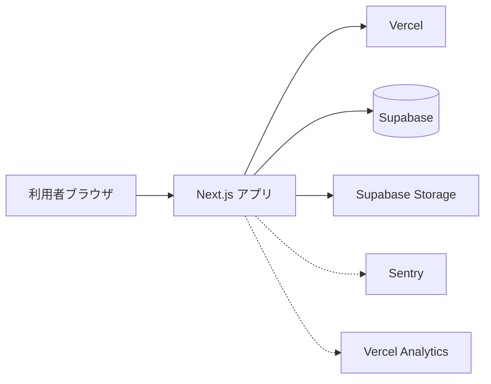
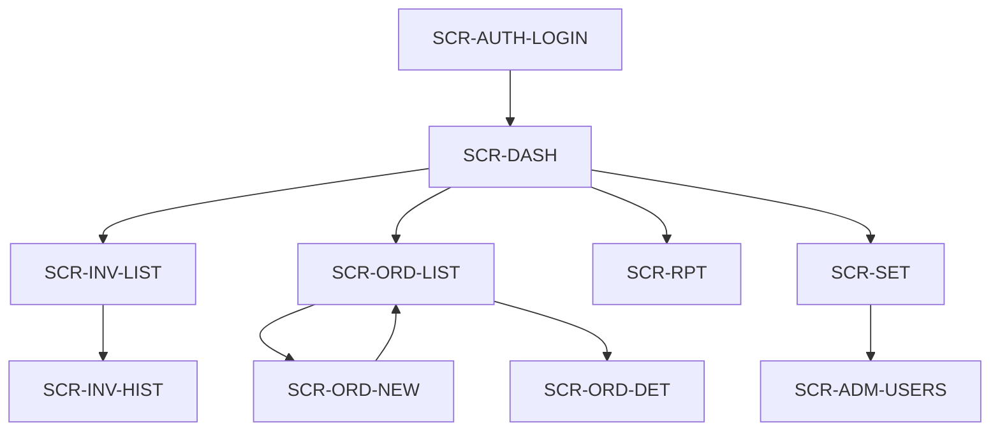

# 在庫管理システム 機能設計書

| 項目 | 内容 |
|------|------|
| 文書名 | 在庫管理システム 機能設計書 |
| 版数 | 0.3.1 |
| 作成日 | 2025-03-21 |
| 根拠 | `doc/要件定義書.md` v1.7 |
| 整備計画 | `doc/スペック駆動開発_ドキュメント整備計画.md` |

本書は要件定義書の**振る舞い・画面・データ・例外・テスト観点**を具体化する。URL・物理テーブル名は**案**であり、実装で変更してよいが、変更時は本書を更新する。

---

## 1. 目的・範囲・用語

### 1.1 目的

実装者・レビュー・E2E 作成者が同一の前提で動けるよう、**画面 ID**、**主要ユースケース**、**論理データ**、**サーバー処理の境界**、**エラー**、**シード規則**を定義する。

### 1.2 範囲

| 扱う | 扱わない |
|------|----------|
| 要件定義書 §5〜§9 に対応するアプリ機能 | UI のピクセル単位（→ デザイン設計書） |
| 認証後の業務画面・注文確定トランザクション | インフラの具体値（→ 技術仕様書） |
| 開発環境向けシード（append） | 決済・返品・出庫スキャン（要件のスコープ外） |

### 1.3 用語（要件書との差分）

| 用語 | 本書での補足 |
|------|----------------|
| 注文確定 | DB への永続化＋在庫減算＋履歴記録を**同一トランザクション**で完了した状態。 |
| 本日 | 集計の基準日時は**サーバー側タイムゾーン**（`技術仕様書.md` §5.1：`Asia/Tokyo` 推奨）。 |
| 税表示 | マスタ単価は**税抜**で保持し、表示時に**固定税率**（例：10%）で内訳を算出する（要件：税法レベルの厳密性は不要）。 |

---

## 2. コンテキスト

### 2.1 システムコンテキスト図

### 2.2 外部サービスとの関係

| 外部 | 用途 |
|------|------|
| Supabase Auth | Google／メールログイン、セッション |
| Supabase PostgreSQL | 正規データ |
| Supabase Storage | 商品画像 |
| Vercel | ホスティング・プレビュー |
| GitHub Actions | CI・E2E・デプロイトリガ（技術仕様書） |
| Sentry / Vercel Analytics | エラー・アクセス（クライアントから送信） |

---

## 3. 画面一覧

**画面 ID** は `デザイン設計書.md` §6・E2E・本書で**同一**とする。

| 画面 ID | 画面名 | URL（案） | 認証 | 要件参照 |
|---------|--------|-----------|------|----------|
| SCR-AUTH-LOGIN | ログイン | `/login` | 不要 | REQ §6.1 |
| SCR-DASH | ダッシュボード | `/` | 要 | REQ §6.2 |
| SCR-INV-LIST | 在庫一覧・検索・入れ子・手動更新・CSV・入庫スキャン | `/inventory` | 要 | REQ §6.3 |
| SCR-INV-SKU | SKU 詳細（閲覧） | `/inventory/sku/[skuId]` | 要 | REQ §6.3 |
| SCR-INV-HIST | 入出庫履歴 | `/inventory/movements` | 要 | REQ §6.3.6 |
| SCR-ORD-LIST | 注文一覧・サマリ | `/orders` | 要 | REQ §6.4.1 |
| SCR-ORD-NEW | 注文作成 | `/orders/new` | 要 | REQ §6.4.2 |
| SCR-ORD-DET | 注文詳細 | `/orders/[orderId]` | 要 | REQ §6.4.3 |
| SCR-RPT | レポート・分析・エクスポート | `/reports` | 要 | REQ §6.5 |
| SCR-SET | 設定 | `/settings` | 要 | REQ §6.6 |
| SCR-ADM-USERS | ユーザー一覧・権限 | `/admin/users` | 要 | REQ §6.7 |

**補足**：在庫アラートは **SCR-DASH** および **SCR-INV-LIST** のサマリで表現してよい（専用 URL は任意）。

---

## 4. ユースケース

### 4.1 認証（Google／メール）

- 利用者が `/login` で Google またはメール／パスワードでサインインする。
- 初回のみ `profiles` 行を作成する（Auth ユーザー ID と 1:1）。
- セッション切れ時は業務 URL へ直アクセスした場合、`/login` に誘導し、元 URL はクエリ等で保持してもよい。

### 4.2 在庫一覧・検索・入れ子表示（SCR-INV-LIST）

- `product_groups` を親行、`product_skus` を子行としてツリーまたはネストテーブル表示。
- 検索：商品名・商品コード・JAN のいずれかに部分一致（方針は実装で統一）。
- 子行の **SKU コード** は **SCR-INV-SKU**（`/inventory/sku/[skuId]`）へのリンクとする。

### 4.3 CSV による商品マスタ更新

- 在庫一覧の **「CSV ダウンロード」** でヘッダー付き CSV を取得 → 編集 → **「CSV アップロード」**。
- 親子の対応は CSV 内のキー（例：`group_code` + `sku_code`）で行う。仕様は **6.2** に合わせてマッピング表を別表で持ってよい。
- エラー行は **8.3** に従い報告する。

### 4.4 在庫手動更新

- 子 SKU の現在庫を編集し保存する。
- `product_skus.quantity` を更新し、`inventory_movements` に `reason = manual_adjust` で差分を記録する。

### 4.5 バーコード入庫

- カメラ等で JAN を読み取り、該当 SKU を特定する。
- 既定の入庫数量（例：1 または入力欄）を加算し、`inventory_movements` に `reason = barcode_inbound` を記録する。

**実装補足（2025-03-21）**: クライアント側の読取には **`window.BarcodeDetector`** を使用している（Chromium 系で利用可能）。未対応環境では手入力を前提とし、UI で案内する。ライブラリ（例：ZXing）へ切り替える場合は本節を更新する。

### 4.6 入出庫履歴閲覧（SCR-INV-HIST）

- `inventory_movements` を時系列で一覧。SKU 名・JAN・理由区分・数量・日時・実行者（取得可能なら）を表示。
- 行の **SKU コード** は **SCR-INV-SKU** へリンクする。

### 4.7 在庫アラート（ルールベース）

- 条件（案）：`quantity <= reorder_point` **または** `quantity < safety_stock` のいずれかでアラート対象。
- 「推奨発注数量」（表示用）：`max(0, safety_stock - quantity)` など**単純式 1 つ**に固定してよい。

### 4.8 注文作成・確定（在庫減算・不足時）（SCR-ORD-NEW）

- スキャンまたは SKU 検索で明細に追加。各行で数量 ±。
- 合計は税抜小計・税額・税込合計を**表示用**に計算（**1.3** の単価・税率前提）。
- **確定**時：**6.4** のトランザクションを実行。在庫不足なら**全体ロールバック**し、不足 SKU をユーザーに示す（REQ §6.4.5）。

### 4.9 注文一覧・詳細（SCR-ORD-LIST / SCR-ORD-DET）

- 一覧：注文番号、確定日時、税込合計、行数など。
- 詳細：ヘッダ金額の内訳＋明細（SKU、数量、単価、行小計、税の内訳）。

### 4.10 ダッシュボード（SCR-DASH）

- 指定期間の売上推移、期間売上、期間注文数、平均注文額。
- 売上ランキング TOP10（SKU または商品グループ単位、いずれか一方に統一）。
- 在庫アラート一覧（上位 N 件など）。

### 4.11 レポート・分析・エクスポート（SCR-RPT）

- 期間・比較軸（前年同月などは任意）を UI で指定可能とする範囲は実装で決定。
- PDF／Excel は **9章** の範囲でダウンロード提供。

### 4.12 設定（SCR-SET）

- アカウント表示名等、`profiles` の更新（任意）。
- DB 接続：軽いヘルスチェック結果を表示。
- 権限：`profiles.role` の表示（第1段階は実質同一でもよい）。
- **開発環境のみ**：シード追加ボタン（**10章**）。

### 4.13 管理者（SCR-ADM-USERS）

- ユーザー一覧（Auth API または `profiles` 結合）。
- ロール変更 UI（第2段階まで効かなくてよいが、DB は更新可）。

---

## 5. 画面遷移

### 5.1 遷移図

グローバルナビから上記主要画面へ遷移可能とする（レイアウトはデザイン設計書）。

### 5.2 未認証時のリダイレクト方針

- `/login` 以外の業務 URL へ未認証でアクセスした場合 → `/login` へリダイレクト。

---

## 6. データ設計（論理）

### 6.1 エンティティ一覧

| 論理名 | 役割 |
|--------|------|
| profiles | Auth ユーザーと 1:1。display_name、role 等 |
| categories | 任意。商品分類 |
| product_groups | 親商品 |
| product_skus | SKU・在庫・JAN・単価・しきい値・画像参照 |
| inventory_movements | 在庫増減履歴 |
| orders | 注文ヘッダ |
| order_lines | 注文明細 |

### 6.2 テーブル定義（論理）

**主キー**はいずれも `id`（UUID）を推奨。自然キーはユニーク制約とする。

#### profiles

| 列（論理名） | 型（案） | 説明 |
|--------------|----------|------|
| id | UUID | PK。`auth.users.id` と同一 |
| display_name | text | 表示名 |
| role | text | `admin` / `user` 等（第1段階は運用上すべて admin でも可） |
| created_at | timestamptz | |

#### product_groups

| 列 | 型（案） | 説明 |
|----|----------|------|
| id | UUID | PK |
| group_code | text | 自然キー（CSV・冪等用） UNIQUE |
| name | text | |
| description | text | 任意 |
| category_id | UUID | 任意 FK |
| sort_order | int | 任意 |
| is_active | boolean | |

#### product_skus

| 列 | 型（案） | 説明 |
|----|----------|------|
| id | UUID | PK |
| product_group_id | UUID | FK |
| sku_code | text | UNIQUE |
| jan_code | text | UNIQUE、検索用 |
| name_variant | text | 色・サイズ等の表示用 |
| color | text | 任意 |
| size | text | 任意 |
| quantity | int | 現在庫（>= 0） |
| reorder_point | int | 再発注点 |
| safety_stock | int | 安全在庫 |
| unit_price_ex_tax | numeric | 税抜単価（**1.3**） |
| image_path | text | Storage パスまたは公開 URL |
| is_active | boolean | |

#### inventory_movements

| 列 | 型（案） | 説明 |
|----|----------|------|
| id | UUID | PK |
| sku_id | UUID | FK |
| quantity_delta | int | 増減（入庫正、注文減算負） |
| reason | text | **6.5** |
| reference_type | text | 任意（`order` 等） |
| reference_id | UUID | 任意（`orders.id` 等） |
| performed_by | UUID | 任意。`profiles.id` |
| created_at | timestamptz | |

#### orders

| 列 | 型（案） | 説明 |
|----|----------|------|
| id | UUID | PK |
| order_number | text | 表示用 UNIQUE（例：`ORD-20250321-0001`） |
| placed_at | timestamptz | 確定日時 |
| subtotal_ex_tax | numeric | 税抜合計 |
| tax_amount | numeric | 税額合計 |
| total_inc_tax | numeric | 税込合計 |
| created_by | UUID | 任意。`profiles.id` |

#### order_lines

| 列 | 型（案） | 説明 |
|----|----------|------|
| id | UUID | PK |
| order_id | UUID | FK |
| sku_id | UUID | FK |
| quantity | int | > 0 |
| unit_price_ex_tax | numeric | 確定時スナップショット |
| line_subtotal_ex_tax | numeric | 税抜小計 |

税額按分は**行ごと**に固定税率で計算し、ヘッダの `tax_amount` と整合を取る（端数は**丸め規則を 1 つ決め**技術仕様または実装コメントに固定）。

### 6.3 自然キー・冪等キー（シード用）

| 対象 | 自然キー／規則 |
|------|----------------|
| product_groups | `group_code`（例：`SEED-G-001` プレフィックス） |
| product_skus | `sku_code`、`jan_code` |
| orders | `order_number`（例：`SEED-ORD-...` プレフィックス） |
| Storage | オブジェクトキー `seed/...` 等 |

既存とキー衝突する行は **INSERT スキップ**または**更新しない**（append のみ、フルリセット禁止）。

### 6.4 注文確定トランザクション

1. 明細ごとに `product_skus.quantity >= line.quantity` を検証。1 行でも不足なら **ABORT**（エラー内容に SKU 識別子を含める）。
2. `orders` INSERT。
3. 各 `order_lines` INSERT。
4. 各明細について：`product_skus.quantity -= quantity`。
5. 各明細について：`inventory_movements` INSERT（`quantity_delta = -quantity`, `reason = order_sale`, `reference_type = order`, `reference_id = orders.id`）。
6. コミット。

失敗時はすべてロールバック。マイナス在庫は許容しない。

**実装方針（推奨）**：Supabase JS クライアントの複数リクエストだけでは **1 DB トランザクション**を保証しにくいため、上記手順を **PostgreSQL の RPC（例：`place_order(...)`）内で `BEGIN…COMMIT`** として実装する。**Server Action は当該 RPC を 1 回呼び出す**形を第一候補とする（詳細は `技術仕様書.md` §4.3）。

### 6.5 `inventory_movements.reason` 区分

| 値 | 意味 |
|----|------|
| `manual_adjust` | 画面手動による在庫修正 |
| `csv_import` | CSV 取込に伴う更新（マスタと同時に在庫を変える場合。在庫を触れない CSV なら未使用） |
| `barcode_inbound` | JAN スキャン入庫 |
| `order_sale` | 注文確定による減算 |

---

## 7. API・サーバー処理

### 7.1 アーキテクチャ方針（案）

- **認証が必要なデータ更新**は原則 **サーバー側**（Server Actions または Route Handler + サーバー上での Supabase クライアント）。**サービスロールキーはクライアントに置かない**（技術仕様書・リポジトリ構造の禁止事項と一致）。
- **CSV／PDF／Excel** のダウンロードは Route Handler またはストレージ署名 URL で提供。
- **読み取り**はクライアントから Supabase（anon + RLS 第1段階）でもよいが、方針は実装で 1 つに統一し技術仕様書に記載。
- **注文確定**は **§6.4** のとおり **DB RPC を推奨**（トランザクション整合性）。

### 7.2 操作一覧（案）

| 操作 | 方法（案） | 関連画面 |
|------|------------|----------|
| ログイン／ログアウト | Supabase Auth（クライアント SDK） | SCR-AUTH-LOGIN |
| ダッシュボード集計 | サーバー集計クエリまたは RPC | SCR-DASH |
| 在庫ツリー取得 | クエリ | SCR-INV-LIST |
| 在庫手動更新 | Server Action | SCR-INV-LIST |
| CSV アップロード | Route Handler または Server Action | SCR-INV-LIST |
| バーコード入庫 | Server Action | SCR-INV-LIST |
| 履歴一覧 | クエリ | SCR-INV-HIST |
| 注文明細の仮状態 | クライアント state（確定まで DB 未保存） | SCR-ORD-NEW |
| 注文確定 | Server Action → **PostgreSQL RPC**（**6.4** の単一トランザクション） | SCR-ORD-NEW |
| 注文一覧／詳細 | クエリ | SCR-ORD-LIST / SCR-ORD-DET |
| レポート集計・エクスポート | Server 処理 | SCR-RPT |
| 接続ヘルス | Route Handler（軽量） | SCR-SET |
| シード append | Server Action（**`ALLOW_DEV_SEED=true` のときのみ**。正は `技術仕様書` §5） | SCR-SET |
| ユーザー／ロール | サーバーのみ。**`SUPABASE_SERVICE_ROLE_KEY`** で Auth Admin API 等（`技術仕様書` §4.6） | SCR-ADM-USERS |

### 7.3 認可（第1段階／第2段階）

- **第1段階**：ログイン済みなら全業務 API を呼び出し可能としてよい。
- **第2段階**：`role` と RLS で SCR-ADM-USERS および行レベル制御を追加。

---

## 8. バリデーション・エラー

### 8.1 入力エラー

- フォームは必須・型・範囲（数量 > 0 等）をクライアント＋サーバーで検証。メッセージはユーザー向けに統一。

### 8.2 在庫不足（注文確定）

- HTTP／アプリコードは実装で統一。本文に **不足 SKU の sku_code または JAN** を含める。
- UI：トーストまたはダイアログで再試行可能にする。

### 8.3 CSV エラー

- 行番号と理由（必須列欠落、型不正、重複キー）を返す。部分適用するか全件拒否かは**全件拒否**を推奨（シンプル）。

### 8.4 認証・セッション

- 401 相当時はログイン誘導。

---

## 9. 帳票・エクスポート

### 9.1 PDF

- 期間・集計内容は SCR-RPT の選択状態と一致させる。
- ライブラリは技術仕様書で確定。

### 9.2 Excel

- 同上。列定義は「注文一覧」「SKU 別売上」等、**最低 1 種類**から開始してよい。

### 9.3 パラメータ（期間・集計粒度）

- `date_from`, `date_to`（必須）、タイムゾーンはサーバー設定に従う。
- 比較期間は任意。

---

## 10. シード（開発環境）

### 10.1 実行条件

- **本番・Preview での UI 表示・API 実行は禁止**。ガードの**正**は環境変数 **`ALLOW_DEV_SEED=true`** のときのみ許可（`技術仕様書` §5.1）。`NODE_ENV` だけに依存しない（Preview も `production` になりうるため）。
- **フルリセット禁止**。**6.3** のキーで衝突回避。

### 10.2 投入データの範囲（案）

- カテゴリ・親商品・SKU（画像パス含む）・過去の `inventory_movements` 若干件・過去の `orders` / `order_lines` 若干件。

---

## 11. テスト観点・E2E 対応

### 11.1 必須シナリオ（CI）

**認証**：CI 上の E2E は **メール／パスワード**のテストユーザーを用いる（Google OAuth の自動化は必須としない）。事前に Supabase またはシードで当該ユーザーを用意する。

| ID | シナリオ | 期待 |
|----|----------|------|
| E2E-01 | ログイン（**メール／パスワード**のテストユーザー） | ダッシュボード表示 |
| E2E-02 | 在庫十分な SKU で注文明細追加→確定 | `orders` 作成、**在庫が減少** |
| E2E-03 | 意図的に在庫不足で確定 | 確定失敗、在庫不変 |

### 11.2 画面 ID との対応

| E2E | 画面 ID |
|-----|---------|
| E2E-01 | SCR-AUTH-LOGIN → SCR-DASH |
| E2E-02〜03 | SCR-ORD-NEW、必要に応じ SCR-INV-LIST |

---

## 12. 要件トレース

| 本書 | 要件定義書 |
|------|------------|
| §3, §4.1, §5.2 | §6.1 |
| §3 SCR-DASH, §4.10 | §6.2 |
| §3 SCR-INV-*, §4.2〜4.7 | §6.3 |
| §3 SCR-ORD-*, §4.8〜4.9, §6.4 | §6.4 |
| §3 SCR-RPT, §4.11, §9 | §6.5 |
| §3 SCR-SET, §4.12 | §6.6 |
| §3 SCR-ADM-USERS, §4.13 | §6.7 |
| §7, §11 | §6.9, §7.5 |
| §6, §10 | §8 |
| §5, §3 | §7.1, §7.2（遷移は間接） |

---

## 改訂履歴

| 版数 | 日付 | 内容 |
|------|------|------|
| 0.1 | 2025-03-21 | テンプレート作成 |
| 0.2 | 2025-03-21 | 初版ドラフト（画面 ID、データ論理、トランザクション、E2E） |
| 0.2.1 | 2025-03-21 | 要件定義 v1.3 参照、本日の TZ を `技術仕様書` §5.1 へ参照 |
| 0.2.2 | 2025-03-21 | 根拠を要件定義書 v1.5 に同期（節参照修正の反映） |
| 0.3 | 2025-03-21 | 注文確定 RPC 推奨、シードは `ALLOW_DEV_SEED` 統一、E2E はメールログイン、管理者は service_role（レビュー反映） |
| 0.3.1 | 2025-03-21 | §4.5 バーコード入庫に `BarcodeDetector` 実装の補足を追記 |
